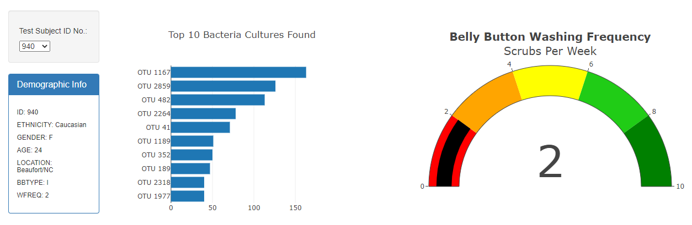
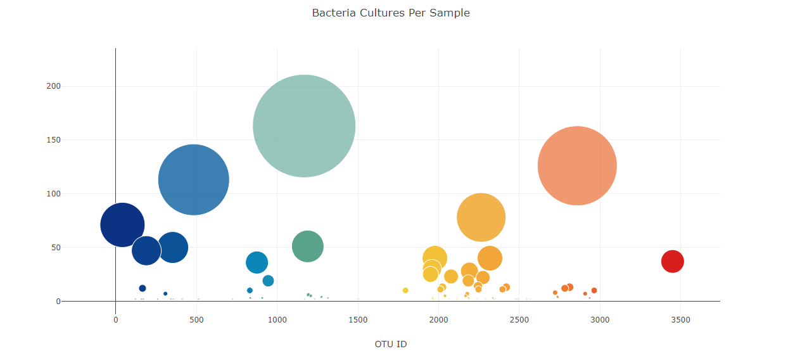

# Belly Button Data Analysis

Bacteria are microorganisms, or microbes, that have many positive uses in food prcessing, including the production of cheese, wine, and yogurt. Improbable Burger hopes to find a microbe on the human body that could have a specific use in the future, whether it be in medicine, food, or fermentation. 

The pupose of this analysis was to gather data based on the bacteria cultures found in the test subject's belly button and to use JavaScript, Plotly, HTML, and CSS to present the findings in a visually applealing and universal manner. 

[Click here](https://maureen220.github.io/plotly_deploy/) for the final website. 

The data of each subject can be accessed though a dropdown menu containing their identification number. There are also three graphs containing visualizations of the data for each subject, as observed in the following images: 

